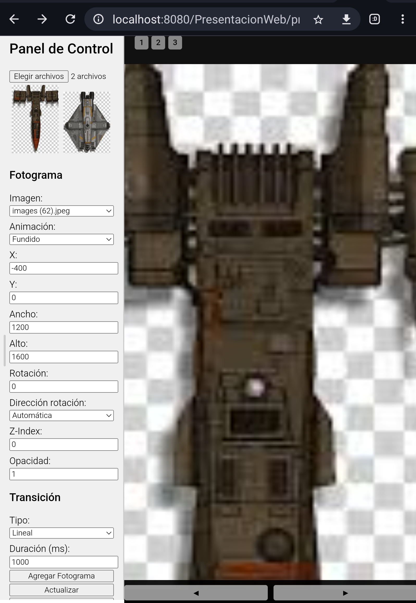

# 🎨 PITCH-Lienzo Interactivo

  

**Una herramienta profesional para crear presentaciones web dinámicas y no lineales con transiciones suaves sobre un lienzo infinito.**

© 2025 Editorial FAD Filigrana & FADCOAD. Todos los derechos reservados.

---

## Descripción del Proyecto

**PITCH - Lienzo Interactivo** es una aplicación web propietaria, desarrollada por **FADCOAD** para **Editorial FAD Filigrana**. Inspirada en las capacidades de herramientas como Sozi, permite la creación de presentaciones de alto impacto a partir de un conjunto de imágenes.

A diferencia de las diapositivas tradicionales, FAD Lienzo Interactivo utiliza un gran lienzo digital donde se pueden posicionar, escalar y rotar recursos visuales con total libertad. El resultado es una única página web HTML que presenta un recorrido fluido y cinematográfico a través de las vistas definidas, ideal para narrativas visuales, demostraciones de productos y contenido educativo de vanguardia.

---

## ✨ Características Principales

* **Lienzo Infinito:** Organiza todos tus recursos visuales en un único espacio de trabajo sin restricciones.
* **Editor Visual Intuitivo:** Sube y manipula imágenes directamente sobre el lienzo de forma sencilla.
* **Transiciones Profesionales:** Define el orden de las vistas y el sistema generará animaciones fluidas (zoom, paneo, rotación) entre ellas.
* **Exportación Web Autónoma:** Genera un único archivo `index.html` que encapsula toda la presentación, listo para su distribución o para ser integrado en otros proyectos web.
* **Rendimiento Optimizado:** Diseñado para ser una herramienta eficiente y robusta para uso comercial.

Puedes probar la aplicación, ingresando a https://fadcoad.com/pitch
---

## ✍️ Autores y Propiedad Intelectual

* **Concepto y Dirección Estratégica:** Editorial FAD Filigrana.
* **Diseño y Desarrollo de Software:** FADCOAD.

*Agradecemos la inspiración de proyectos innovadores en el campo de las presentaciones visuales.*

---

## 📄 Licencia y Derechos de Uso

Este software es **software propietario y confidencial**.

El acceso a este repositorio y a su código fuente está restringido a los miembros autorizados del equipo de Editorial FAD Filigrana y FADCOAD. Queda estrictamente prohibida la copia, modificación, distribución, venta o cualquier otro uso no autorizado de este software o de cualquiera de sus partes sin el consentimiento explícito y por escrito de los titulares de los derechos.
